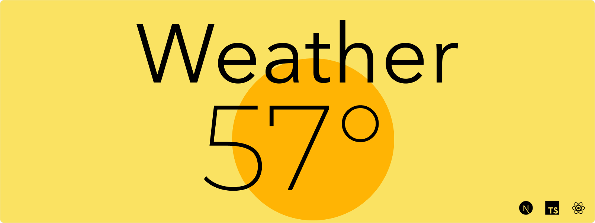
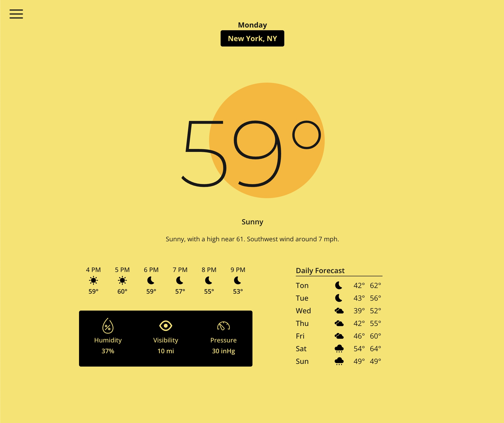
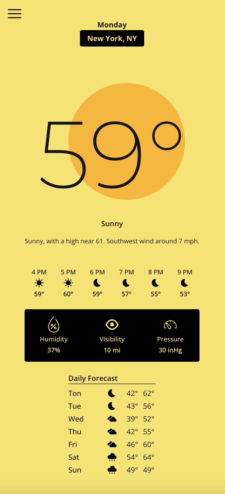

<p align="center">
    <picture>
        <source media="(prefers-color-scheme: dark)" srcset="public/assets/repoimagedark.png">
        <source media="(prefers-color-scheme: light)" srcset="public/assets/repoimagelight.png">
        
    </picture>
</p>
<h1 align="center">Weather App</h1>
<p align="center">
This is a simple weather app that fetches real-time weather data using the NOAA API. The app provides accurate weather conditions, including temperature, humidity, wind speed, and forecasts for a given location.
<p align="center">
    
    
</p>

<p align="center">
    
    <br>
    
</p>


## Tech Stack

| Technology       | Description                                                                                                           |
|------------------|-----------------------------------------------------------------------------------------------------------------------|
| **Framework**    | [Next.js](https://nextjs.org/) - A React framework for building server-side rendered and static web applications.     |
| **Backend**      | [Node.js](https://nodejs.org/) - A JavaScript runtime built on Chrome's V8 JavaScript engine, used for building scalable network applications. |
| **Containerization** | [Docker](https://www.docker.com/) - A platform for developing, shipping, and running applications in containers, enabling consistent environments across development and production. |

## Environment Variables

To run this project, you will need to add the following environment variables to your `.env` file:


| Environment Variable      | Description                                                                                                           |
|---------------------------|-----------------------------------------------------------------------------------------------------------------------|
| `USER_AGENT_EMAIL`         | Required by the NOAA National Weather API to identify your application. Include contact information (website or email) so they can contact you if your string is associated with a security event. |

## Running the App

### Using Docker

To run the app in a Docker container, follow these steps:

1. Clone the repository
    ```sh
    git clone https://github.com/albdangarcia/weather-app.git
    ```
1. Navigate to the project directory
    ```shell
    cd weather-app
    ```
1. Copy the `.env.example` file to `.env` and update the environment variables:
    ```sh
    cp .env.example .env
    ```
1. Build the Docker image:
    ```sh
    docker compose build
    ```
1. Run the Docker container:
    ```sh
    docker compose up
    ```
1. Open your browser and navigate to `http://localhost:3000`


### Run Locally

To run the app locally, follow these steps:

1. Clone the repository
    ```sh
    git clone https://github.com/albdangarcia/weather-app.git
    ```
1. Navigate to the project directory
    ```shell
    cd weather-app
    ```
1. Copy the `.env.example` file to `.env` and update the environment variables:
    ```sh
    cp .env.example .env
    ```
1. Install the dependencies:
    ```sh
    npm install
    ```
1. Run the app:
    ```sh
    npm run dev
    ```

## TODO

- [ ] Add Night Mode.

## Credits
- [NOAA National Weather Service API](https://www.weather.gov/documentation/services-web-api)
- SVG Icons from [svgrepo](https://www.svgrepo.com/)

## License

Licensed under the [MIT](LICENSE) license.
